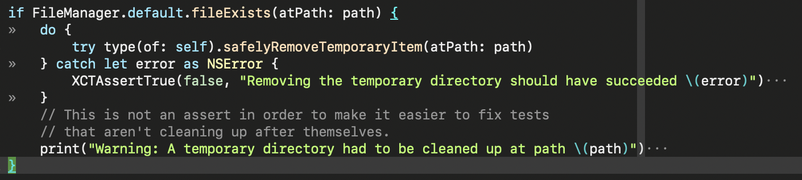

Vim has a lovely configurable whitespace visibility feature that I've started missing whenever I another text editor. The feature is configured using the `listchars` variable, I set mine up from this up from [`-romainl-` on Reddit](https://www.reddit.com/r/vim/comments/4hoa6e/what_do_you_use_for_your_listchars/) years ago without thinking much about it at the time:

	set listchars=tab:»\ ,extends:›,precedes:‹,nbsp:·,trail:·

These rules means:

1. Show tabs as `»`.
2. [Non-breaking space - Wikipedia](https://en.wikipedia.org/wiki/Non-breaking_space) as `·`.
3. Show trailing whitespace as `·`.

Here's what a bit source code looks like with this feature configured this way:

For comparison, here's TextMate with the "Show Invisible Characters" option on:

Looks cluttered to me.

Sublime Text has an interesting solution to this problem, with the `"draw_white_space": "selection",` configuration option on:

The problem with this is that you have to know when to turn it on.