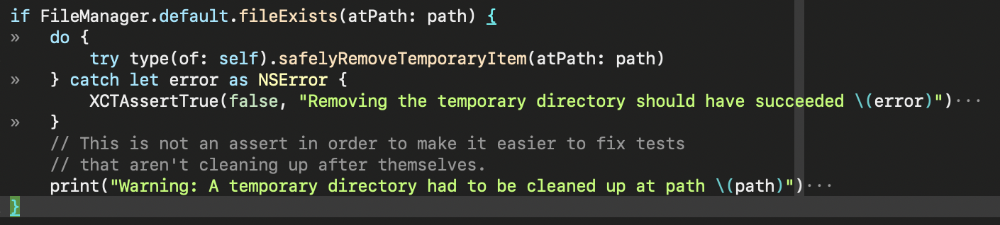
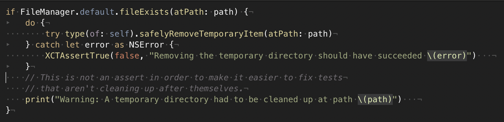
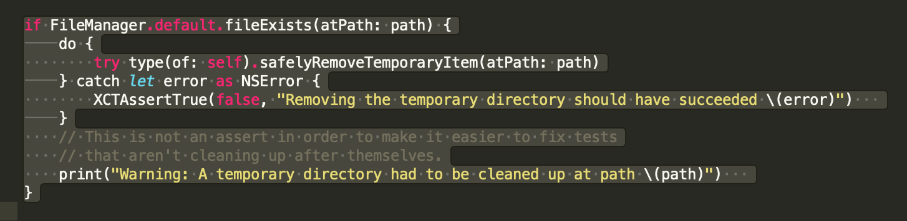

Vim has a lovely configurable whitespace visibility feature that I've found I now miss in other text editors. The feature is configured using the `listchars` variable, mine is setup as follows courtesy of [-romainl- on Reddit](https://www.reddit.com/r/vim/comments/4hoa6e/what_do_you_use_for_your_listchars/):

	set listchars=tab:»\ ,extends:›,precedes:‹,nbsp:·,trail:·

Here's an explanation of the rules[^missing]:

1. Show tab characters as `»`.
2. Show [non-breaking space](https://en.wikipedia.org/wiki/Non-breaking_space) characters as `·` (to differentiate them from regular spaces).
3. Show trailing whitespace as `·`.

Here's what this looks like in a code snippet where I've deliberately converted some spaces to tabs and added some trailing whitespace:

What's great about this configuration is that it adds the minimum amount of visual clutter possible to communicate maximum amount of information. With the option configured I'm confident the whitespace is as intended in any document I work on.

By comparison, here's [TextMate](https://macromates.com/) with its "Show Invisible Characters" option turned on:

I sometimes use this option when I'm cleaning up a document in TextMate, but it's too cluttered for me to leave it on all the time.

[Sublime Text](http://www.sublimetext.com/) has an interesting solution to this problem, when the `draw_white_space` option is set to `selection` (i.e., `"draw_white_space": "selection"`), Sublime Text will show the white space characters in the highlighted selection:

This is decent, I have this feature turned on, but it isn't as good as the Vim configuration because I'll only see whitespace issues if make a selection to look for them. With the Vim configuration, I always know know the state of all of the whitespace on the screen without needing to take any additional action, and with the smallest amount of clutter possible.

* * *

[^missing]: I'm skipping `precedes` and `extends` because they aren't directly related to whitespace.
